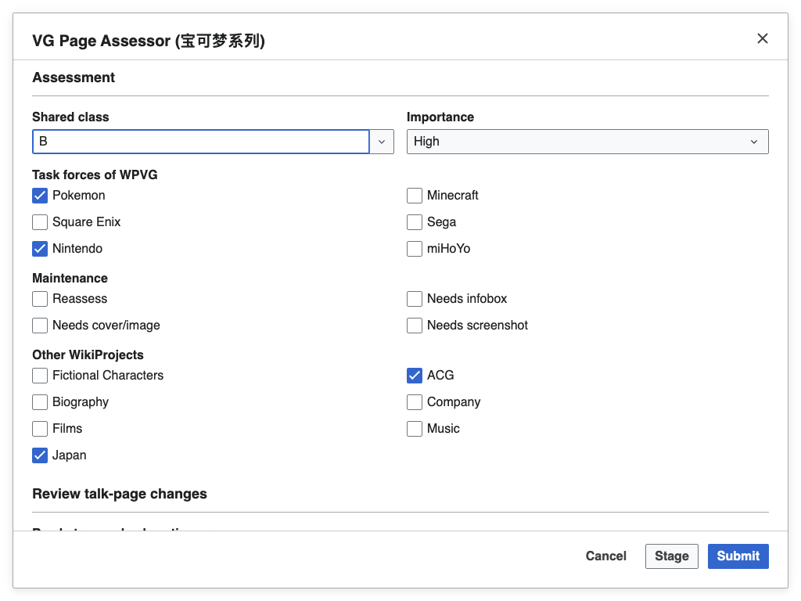
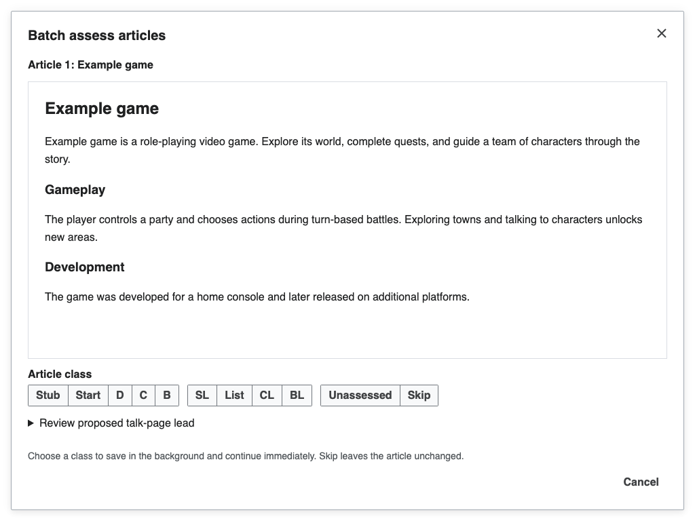

# WPVG Assessor

A standalone Chinese Wikipedia gadget for assessing video-game articles and
registering eligible articles on the WikiProject new-page list.

This tool is early-development software. Review the proposed talk-page source
and list changes before choosing **Submit**. In category assessment, choosing
a class starts a background save and moves immediately to the next article.

## Features

Assessment example: supplied talk-page banners for
[宝可梦系列](https://zh.wikipedia.org/wiki/宝可梦系列); see
[attribution and terms](THIRD-PARTY-NOTICES.md#documentation-assessment-example).

- Class and importance choices, task forces, maintenance flags, and related
  project banners initialized from the existing talk page.
- Editable proposed source, highlighted changes, and separate edit summaries
  to review before assessment and new-page registration.
- Shared **Stage / Unstage** drafts across browser tabs, with **Submit (+N)**
  for combined review and submission.
- Category assessment with an article preview, background saves, preloading,
  and explicit retry of failed articles.

The interface follows your Wikipedia language: English, Simplified Chinese,
or Traditional Chinese. See the [review workflow](docs/review-workflow.md)
for assessment rules, staged drafts, category actions, and conflict recovery.

## How to use

From the [latest release](../../releases/latest), copy the contents of
[wpvg_assessor.min.js](https://github.com/For-Each-Next/wp-wpvg-assessor/releases/latest/download/wpvg_assessor.min.js)
into `Special:MyPage/common.js` on Chinese Wikipedia, or add it as a site gadget.
Tampermonkey users can install
[wpvg_assessor.user.js](https://github.com/For-Each-Next/wp-wpvg-assessor/releases/latest/download/wpvg_assessor.user.js)
instead. Install one artifact and refresh Wikipedia.

Open an article or its talk page and choose **VG Page Assessor** from the page
tools. Set its assessment, review the source and edit summaries, and choose
**Submit**. Registration is offered when the article meets the eligibility
rules. **Out of scope** omits the Video games banner while retaining shared
class and other projects.

To assess several pages together, review each and choose **Stage (暂存)**.
The shared draft survives navigation and reloads; **Unstage (取消暂存)**
removes it while keeping the current form edits. **Submit (+N)** reviews the
combined batch, then a second **Submit** saves those reviewed changes.

On [Category:未评级电子游戏条目](https://zh.wikipedia.org/wiki/Category:未评级电子游戏条目),
choose **Batch assess articles (批量评级条目)**. Read the preview, expand
**Review proposed talk-page lead** if needed, and choose a class to save that
assessment and advance. **Skip** advances without saving. Failed articles
return for review and explicit retry. **Cancel** closes the interface while
pending saves finish; failed reviews remain available in the same tab until
reload.

Development instructions are in [CONTRIBUTING.md](CONTRIBUTING.md), with the
source boundaries described in [architecture](docs/architecture.md).

## License

Project-owned material is dedicated under [CC0 1.0](LICENSE). Wikimedia data
and external packages retain their terms; see
[third-party notices](THIRD-PARTY-NOTICES.md). Documentation assessment examples
retain their attribution and source history as described in those notices.
