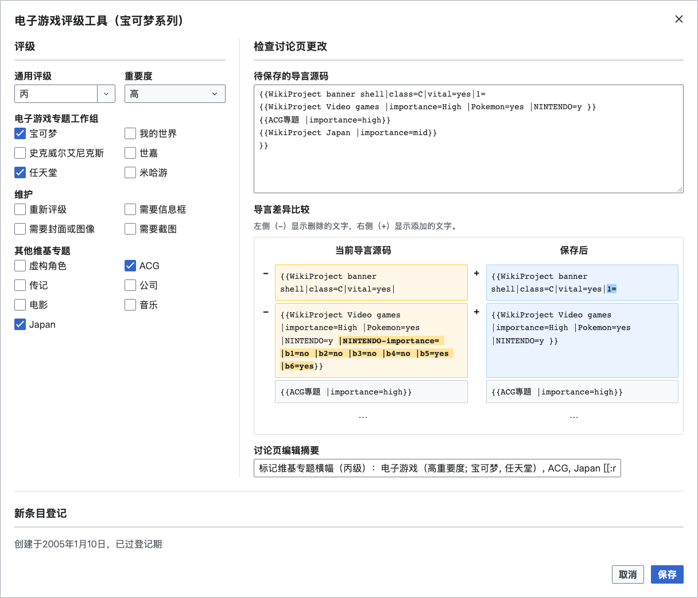

# WPVG Assessor

A standalone Chinese Wikipedia gadget for assessing video-game articles and
registering eligible articles on the WikiProject new-page list.

This tool is early-development software. Review the proposed talk-page source
and list changes before choosing **Submit**.

## Features

Example: [宝可梦系列](https://zh.wikipedia.org/wiki/宝可梦系列), using its supplied
talk-page banners.

[View the stacked layout for narrower screens](docs/images/screenshot-narrow.png).

### Assessment

- Class and importance choices, task forces, maintenance flags, and related
  WikiProject banners, initialized from the existing talk page.
- An editable **Shared class** combobox for common choices and other class
  codes. `Bplus` and `b+` are recognized as B+ (乙上 in Chinese); less common
  classes stay out of the menu and can be entered directly.
- An **Out of scope** importance choice that removes or omits the
  Video games banner and disables its tags and new-page registration. The
  shared WPBS class remains editable for other projects or class-only
  reassessment.
- Editable proposed source and highlighted changes to review before saving.
- Existing discussion sections and unrelated lead content preserved.
- Existing banner-shell settings such as `vital=yes` preserved while project
  banners are merged into the shell and retired Video games parameters are
  removed.

### New-page registration

- Registration of eligible articles on the WikiProject new-page list, with
  creation dates and ordering handled automatically.
- A separate change preview and edit summary before registration.
- Clear explanations when an article is already listed or outside the
  registration period.
- A **Stage (暂存)** button that queues reviewed pages in the background.
  The same **Submit (+N)** button includes the other queued pages and combines
  their registrations into one list edit.

The interface uses English, Simplified Chinese, or Traditional Chinese,
according to your Wikipedia interface language.

## How to use

Copy the contents of `wpvg_assessor.min.js` into
`Special:MyPage/common.js` on Chinese Wikipedia, or add it as a site gadget.
Tampermonkey users can install `wpvg_assessor.user.js` instead.

Refresh Wikipedia after installation, open an article or its talk page, and
choose **VG Page Assessor** from the page tools. Select the assessment, review
the proposed source and changes, and choose **Submit**. New-page registration
is available when the article meets the configured eligibility rules.

To assess several pages together, choose **Stage (暂存)** after reviewing each
page, then navigate to the next page in the same browser tab. Staging keeps
the form open and changes the same button to **Unstage (取消暂存)**. Choose it
to remove the current page from the queue while retaining the edits in the
form. These actions do not edit Wikipedia. Reopening restores
the staged source and summaries and reuses loaded page data. **Submit (+3)**
means the current page will be submitted with three other staged pages.
Choose it to review the combined batch, then choose **Submit** again to save
the reviewed changes. Drafts survive navigation and reloads in that tab and
are removed as their submissions finish successfully.

For a page outside WikiProject Video games, choose **Out of scope**
under **Importance**. You can still set the shared class and select other
projects, such as ACG. Existing banner shells and recognizable project banners
without a Video games banner start with this choice selected.

The gadget runs only on Chinese Wikipedia. Install just one of these files.

## License

Project-owned material is dedicated under [CC0 1.0][1]. Wikimedia data and
external packages retain their terms; see [third-party notices][2].

[1]: LICENSE
[2]: THIRD-PARTY-NOTICES.md
