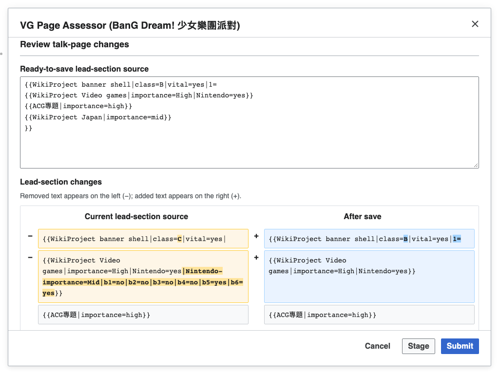

# WPVG Assessor

[English](README.md) · [繁體中文](README.zh-Hant.md) · [简体中文](README.zh-Hans.md)

在中文維基百科評定電子遊戲條目，並將符合資格的條目登記至專題新進條目列表。

<!-- toc:start -->

## 目錄

- [主要功能](#主要功能)
- [安裝](#安裝)
- [使用方式](#使用方式)
- [畫面範例](#畫面範例)
- [說明](#說明)
- [授權](#授權)

<!-- toc:end -->

## 主要功能

- 從現有討論頁橫幅載入品質、重要度、任務組與維護標記。
- 提交前檢查可編輯的預定原始碼、差異與獨立編輯摘要。
- 跨分頁暫存草稿，一次提交多篇已檢查的評級。
- 以條目預覽進行分類批次評級，背景儲存並明確重試失敗項目。

## 安裝

安裝可閱讀的 [Tampermonkey 使用者腳本](https://github.com/For-Each-Next/wp-wpvg-assessor/releases/latest/download/wpvg_assessor.user.js)，或將最新 [MediaWiki 小工具](https://github.com/For-Each-Next/wp-wpvg-assessor/releases/latest/download/wpvg_assessor.min.js) 內容貼入中文維基百科的 `Special:MyPage/common.js`。選擇一種安裝方式後重新載入頁面；提交使用目前登入的維基帳號。[版本列表](https://github.com/For-Each-Next/wp-wpvg-assessor/releases)。

移除工具時，停用 Tampermonkey 中對應的腳本，或從 `common.js` 刪除工具程式碼，再重新載入維基百科。

## 使用方式

開啟條目或討論頁，在頁面工具中選擇 **電子遊戲頁面評級工具**。設定評級，核對討論頁原始碼與編輯摘要後選擇 **提交**。只有符合資格的條目才會提供新進條目登記。

選擇 **暫存** 可保留草稿並繼續瀏覽其他頁面。**取消暫存** 從佇列移除草稿，但保留目前的表單修改。**提交 (+N)** 開啟整批檢查，再按一次 **提交** 才儲存已檢查的內容。

在[未評級電子遊戲條目分類](https://zh.wikipedia.org/wiki/Category:未评级电子游戏条目)選擇 **批次評級條目**。閱讀條目預覽，必要時展開預定討論頁原始碼。**選擇品質等級會立即儲存該次評級，並移至下一篇。** **略過** 不儲存；**取消** 關閉介面，已開始的儲存仍會完成。失敗項目保留在同一分頁供重試，直到重新載入。

## 畫面範例

以下離線畫面取材自 **BanG Dream! 少女樂團派對** 條目原始碼（版本 94028176）；得分者、分數、評級橫幅與 API 結果均為示範資料，不代表實際評定。

[來源署名與修改說明](THIRD-PARTY-NOTICES.md#documentation-article-fixture).

## 說明

資格、暫存、批次操作與衝突復原詳見[檢查流程](docs/review-workflow.md)。介面依維基百科語言設定顯示英文、繁體中文或簡體中文。

開發資訊見 [CONTRIBUTING.md](CONTRIBUTING.md)。

## 授權

專案自有內容依 [CC0 1.0](LICENSE) 釋出。維基媒體內容與外部套件保留各自條款。另見[第三方聲明](THIRD-PARTY-NOTICES.md)。
